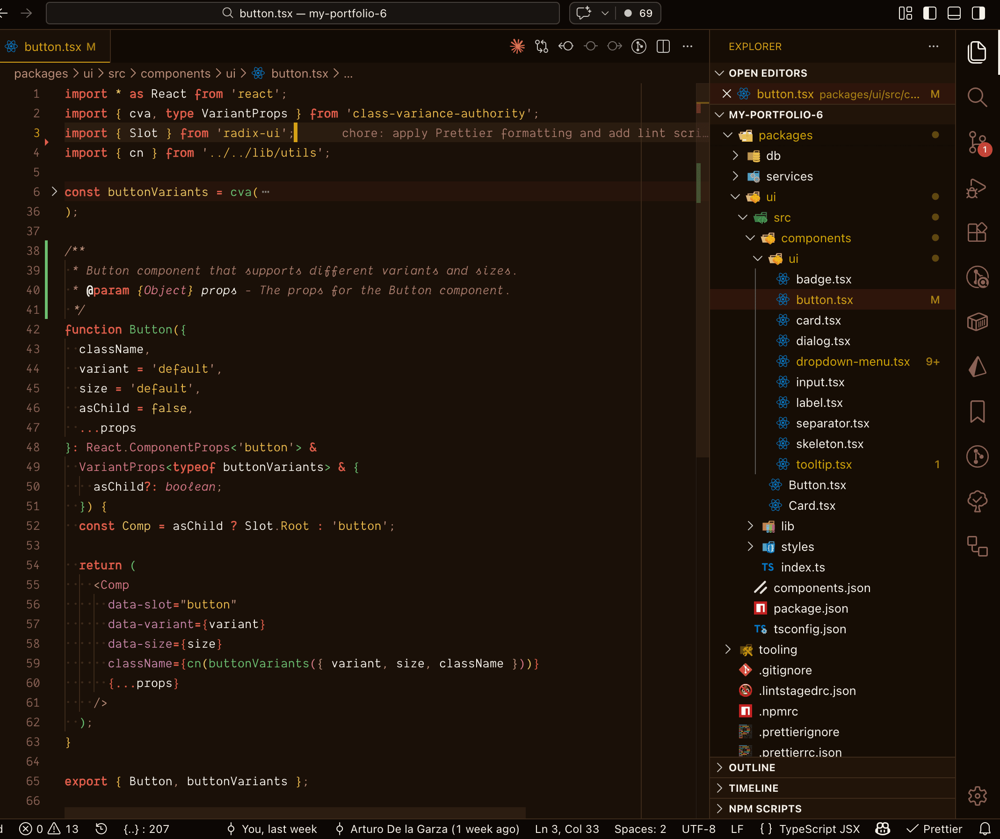
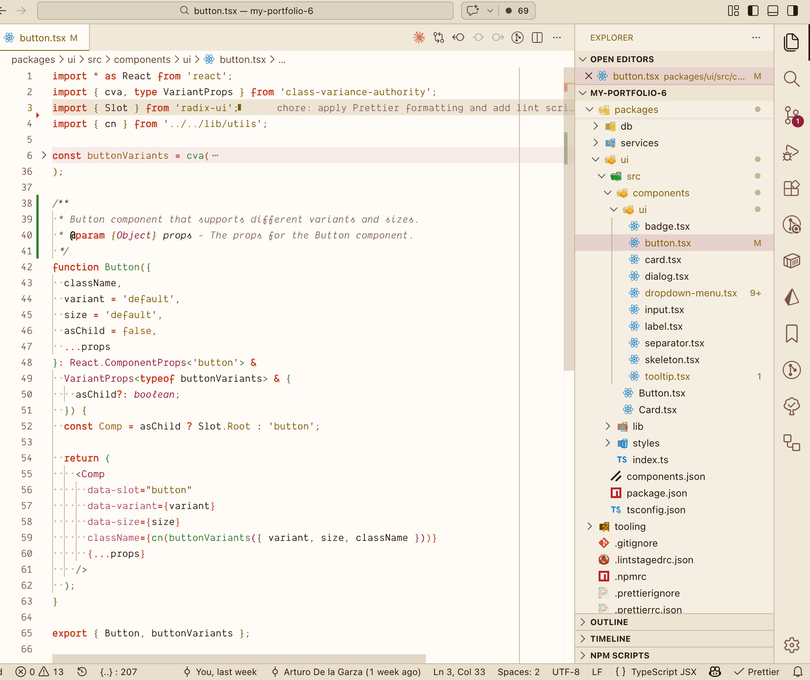
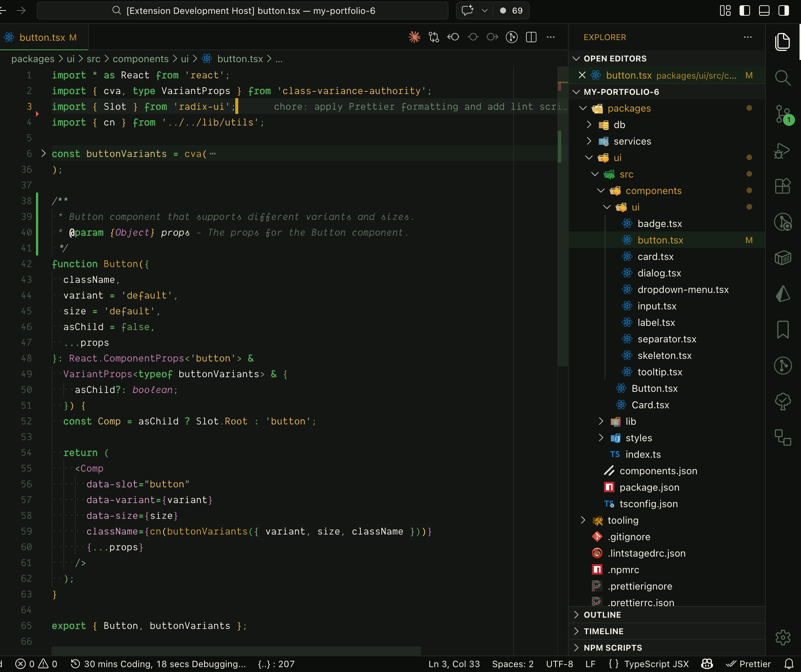
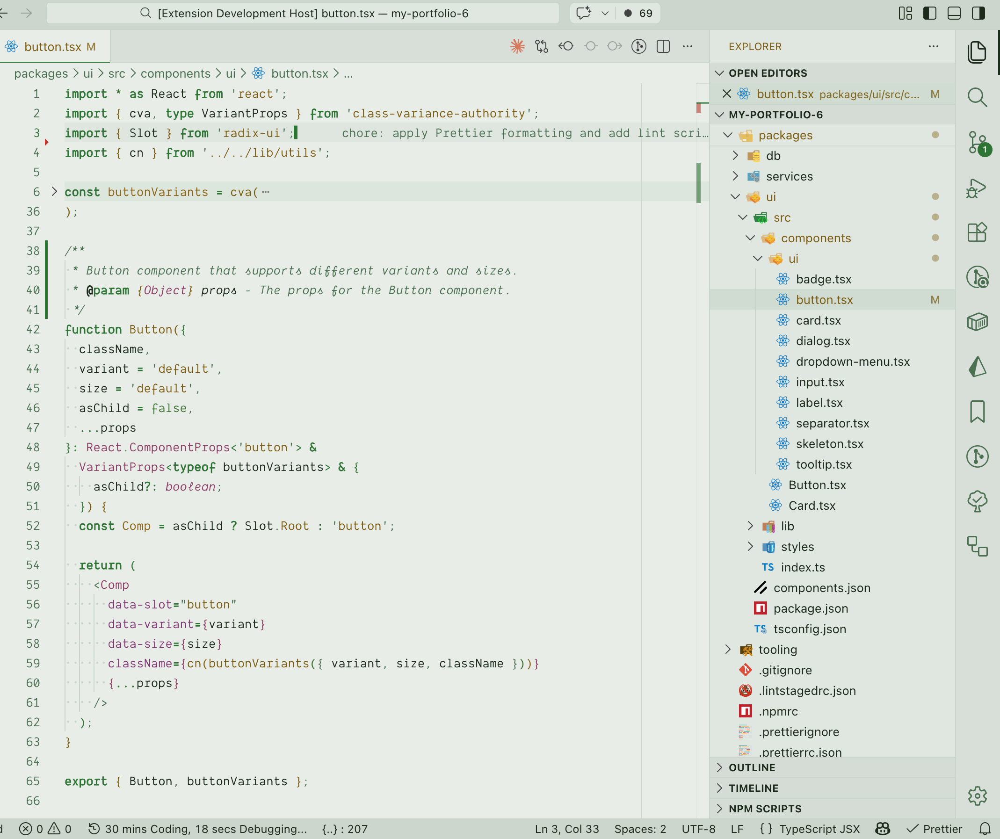

# Chilaquiles Theme

A VS Code color theme inspired by the Mexican dish chilaquiles —
two flavor variants, four themes total.

## Screenshots

### Chilaquiles Rojos (Dark)

### Chilaquiles Rojos (Light)

### Chilaquiles Verdes (Dark)

### Chilaquiles Verdes (Light)

## Variants

### Rojos

- **Chilaquiles Rojos (Dark)** — Night Comal background (`#1A1008`) with warm
  chili reds, toasted corn golds, and cilantro greens
- **Chilaquiles Rojos (Light)** — Crema background (`#FFFBF5`) with
  contrast-adjusted red and gold tones

### Verdes

- **Chilaquiles Verdes (Dark)** — Charcoal background (`#141614`) with
  tomatillo green, corn chip gold, and pickled onion purple
- **Chilaquiles Verdes (Light)** — Sage background (`#E8EDE8`) with deep
  roasted green, amber gold, and avocado accents

## The Palette

All token colors meet WCAG AA contrast requirements (4.5:1 minimum).

### Rojos

| Role | Dark | Light |
| ---- | ---- | ----- |
| Keywords | Vivid Tomato `#E05C4B` | Chili Pepper `#C4391C` |
| Tags / Types | Rose Chili `#D97085` | Ancho Burgundy `#8C1D35` |
| Attributes | Lilac Onion `#C480B0` | Pickled Onion `#A64D79` |
| Strings | Corn Gold `#E8B84B` | Tortilla Gold `#7B5B00` |
| Numbers | Pale Gold `#E8C96A` | Egg Yolk Amber `#A05600` |
| Functions | Bright Cilantro `#6DBF72` | Avocado Green `#2E7D32` |
| Comments | Adobe `#A67B6A` | Onion Skin `#826858` |

### Verdes

| Role | Dark | Light |
| ---- | ---- | ----- |
| Keywords | Tomatillo Green `#4CAF50` | Deep Roasted Green `#2A7530` |
| Tags / Types | Pickled Onion `#C97DB5` | Pickled Onion `#8E3A65` |
| Attributes | Pale Onion `#D99DC8` | Pickled Onion `#853678` |
| Strings / Properties | Corn Chip Gold `#E8B84B` | Tortilla Gold `#7D5C00` |
| Numbers | Avocado Green `#6FAF5A` | Avocado Green `#3E7530` |
| Functions | Corn Chip Gold `#D4A017` | Tortilla Gold `#7D5C00` |
| Comments | Muted Sage `#5C6E5E` | Muted Sage `#4A7050` |

## Features

- **Full editor UI theming** — activity bar, sidebar, tabs, status bar, terminal, notifications, inputs, and more
- **Semantic token support** — enhanced highlighting for TypeScript/JavaScript via language server
- **Language-specific overrides** — TS/JS generics, arrow functions, interface names, built-in types
- **WCAG AA compliant** — all token colors meet 4.5:1 contrast ratio minimum

## Installation

Install from the [VS Code Marketplace](https://marketplace.visualstudio.com/items?itemName=agzertuche.chilaquiles-theme) or search for **Chilaquiles Theme** in the Extensions panel.

Then: `Ctrl+K Ctrl+T` (or `Cmd+K Cmd+T` on Mac) → select your preferred variant.

## License

MIT
